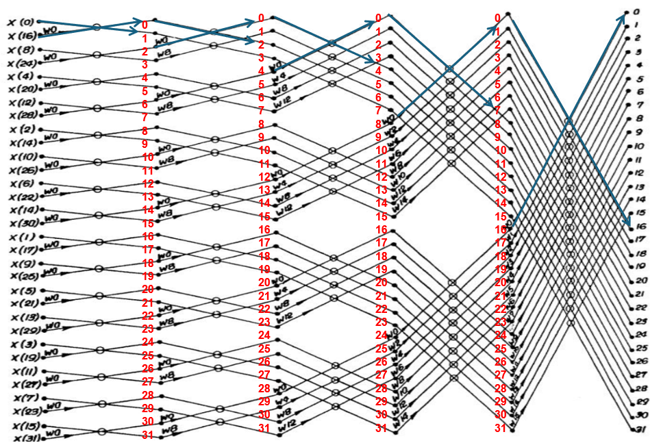

# FFT32 Hardware Implementation

This repository contains a Verilog-based hardware implementation of a **32-point Fast Fourier Transform (FFT)**. The design targets FPGA/ASIC deployment for high-performance signal processing applications.

---

## 📂 Repository Structure

```
fft32/
│
├── rtl/                                      # RTL source code and models
│   ├── complex_MAC.v                         # Complex multiply-accumulate unit
│   ├── top.v                                 # Top-level FFT32 module
│   ├── twiddle_ROM.v                         # ROM for twiddle factors
│   └── testbench & golden models/            # Testbenches and Python golden models
│       ├── butterfly_out.py                  # Python model for butterfly output
│       ├── check outputs.py                  # Output checker script
│       ├── fft32_from_q26.py                 # FFT model with Q26 fixed-point format
│       ├── generate_inputs.py                # Input vector generator
│       ├── fft32_q56.mem                     # Precomputed FFT memory file
│       ├── fft_stage1.mem                    # FFT stage 1 data
│       ├── fft_stage2.mem                    # FFT stage 2 data
│       ├── fft_stage3.mem                    # FFT stage 3 data
│       ├── fft_stage4.mem                    # FFT stage 4 data
│       ├── fft_stage5.mem                    # FFT stage 5 data
│       ├── input_vec_test1.mem               # Test input vector 1
│       └── input_vec_test2.mem               # Test input vector 2
│
├── top_tb.v                                  # Top-level testbench
│
├── fft32_diagram.png                         # Block diagram for FFT32 architecture
│
├── results.txt                               # Simulation results
│
└── run.txt                                   # Simulation or synthesis run log
```

---

## 📖 Description

The project implements a **32-point Radix-2 Decimation-in-Time (DIT) FFT** algorithm, optimized for hardware realization. Key components include:

- **Complex Multiply-Accumulate (MAC) Unit**
- **Twiddle Factor ROM**
- **Hierarchical Pipelined Structure**
- **Python Golden Models** for verification

---

## 📝 Features

- Fixed 32-point FFT with modular Verilog design.
- Python scripts for golden reference models and input generation.
- Support for fixed-point input/output.
- Pipeline-based FFT computation for high throughput.

---

## 🗂️ Block Diagram



---

## ✅ Simulation, Synthesis & Analysis

- Simulations are performed via Verilog testbenches and compared with Python models.
- Synthesis and timing analysis are performed using **Vivado** targeting **Xilinx Artix-7 FPGA**.
- Power and timing reports are generated to assess hardware performance.

---

## 📬 Contact

For questions or contributions, please open an issue in the repository.

---

© 2025 Sara Elgammal
